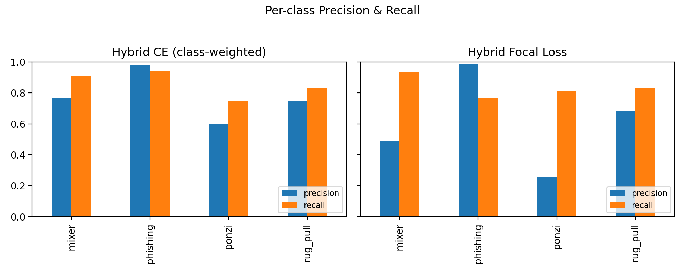

# Day 2 Results — Baselines & Hybrid

## Baselines
- Logistic, RF, XGB trained on tabular features.
- Best performance: **XGB** with macro F1 ≈ 0.940.

## Hybrid (Tabular + Graph Embeddings)
- Accuracy: 0.915
- Macro F1: 0.739
- Observations: Hybrid struggles on Ponzi (few samples), better structural capture for Rug Pull.

## Confusion Matrices
- Tabular: `artifacts/plots/confusion_tabular.png`
- Hybrid: `artifacts/plots/confusion_hybrid.png`

---

**Takeaway:** Baselines (XGB) are very strong due to clean tabular features.  
Hybrid adds novelty with graph embeddings but needs more balanced data to shine.

## Extra: PyTorch CE vs Focal Comparison
| Model        |   Accuracy |   Macro F1 |   Ponzi Recall |
|:-------------|-----------:|-----------:|---------------:|
| Tabular CE   |      0.917 |      0.784 |          0.688 |
| Hybrid CE    |      0.924 |      0.812 |          0.75  |
| Hybrid Focal |      0.789 |      0.661 |          0.812 |

